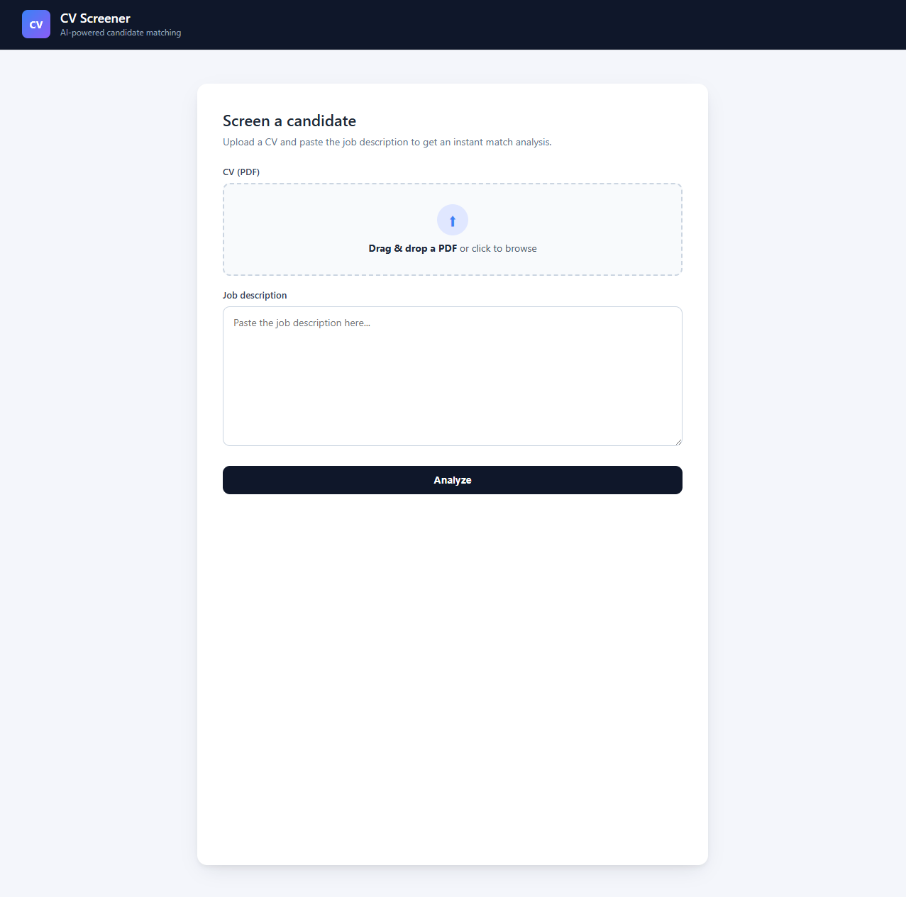
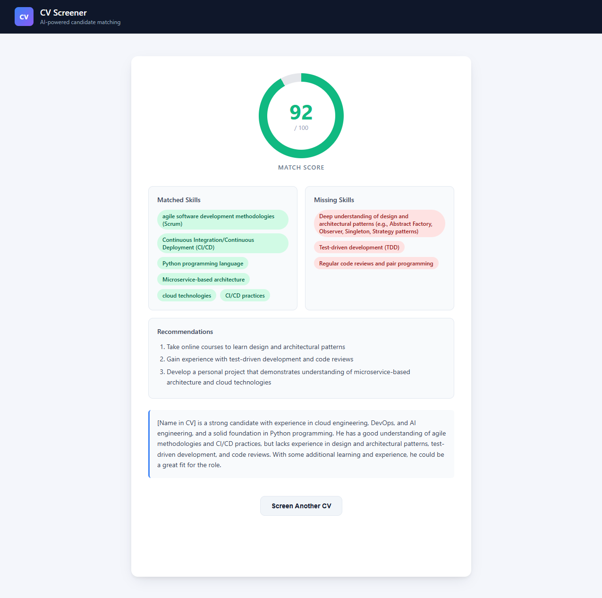

# CV Screener — AI-Powered Candidate Matching

A full-stack web application that analyzes a candidate's CV against a job description using a large language model, returning a structured match score, identified skill gaps, and actionable recommendations.

**Live demo:** [cv-screener-eosin.vercel.app](https://cv-screener-eosin.vercel.app)





---

## What it does

1. Upload a CV in PDF format
2. Paste a job description
3. Receive an AI-generated match report including:
   - A match score out of 100
   - Skills the candidate has that match the role
   - Genuine skill gaps (semantic matching — not just keyword search)
   - Specific, actionable recommendations tailored to the candidate
   - A plain-English summary

---

## Tech Stack

| Layer            | Technology                 |
| ---------------- | -------------------------- |
| Frontend         | React 18, Vite             |
| Backend          | Python, FastAPI            |
| LLM              | Llama 3.3 70B via Groq API |
| PDF Parsing      | PyMuPDF                    |
| Containerization | Docker, Docker Compose     |
| Frontend Hosting | Vercel                     |
| Backend Hosting  | Render                     |

---

## Running Locally

### Prerequisites

- Python 3.12+
- Node.js 20+
- A free [Groq API key](https://console.groq.com)

### 1. Clone the repo

```bash
git clone https://github.com/your-username/cv-screener.git
cd cv-screener
```

### 2. Backend

```bash
cd backend
python3 -m venv .venv
source .venv/bin/activate
pip install -r requirements.txt
```

Create a `.env` file in the `backend/` directory:

```
GROQ_API_KEY=your_groq_api_key_here
```

Start the server:

```bash
uvicorn main:app --reload
```

Backend runs at `http://localhost:8000`

### 3. Frontend

```bash
cd frontend
npm install
npm run dev
```

Frontend runs at `http://localhost:5173`

---

## Running with Docker

```bash
# From the project root
GROQ_API_KEY=your_key_here docker compose up --build
```

Open `http://localhost:5173`

---

## API

### `POST /screen`

Analyzes a CV against a job description.

**Request** — multipart form data:
| Field | Type | Description |
|---|---|---|
| `cv_file` | File (PDF) | The candidate's CV |
| `job_description` | String | The full job description text |

**Response:**

```json
{
  "match_score": 84,
  "matched_skills": ["Python", "FastAPI", "Docker", "CI/CD"],
  "missing_skills": ["Kubernetes"],
  "recommendations": [
    "Build a small Kubernetes project to cover the one identified gap",
    "Add measurable impact to CV bullet points (e.g. users served, latency reduced)"
  ],
  "summary": "Strong backend profile that covers most of the role's requirements. The main gap is hands-on Kubernetes experience, which could be addressed with a short side project."
}
```

### `GET /health`

Returns `{"status": "ok"}` — used by Docker healthchecks.

---

## Project Structure

```
cv-screener/
├── backend/
│   ├── main.py          # FastAPI app and routes
│   ├── gemini.py        # LLM client and prompt logic
│   ├── pdf_parser.py    # PDF to text extraction
│   ├── models.py        # Pydantic request/response models
│   ├── requirements.txt
│   └── Dockerfile
├── frontend/
│   ├── src/
│   │   ├── App.jsx
│   │   ├── App.css
│   │   └── api.js
│   ├── index.html
│   ├── package.json
│   ├── vite.config.js
│   └── Dockerfile
├── docker-compose.yml
└── .github/
    └── workflows/
        └── ci.yml
```

---

## Design Decisions

**Semantic skill matching** — the LLM prompt is engineered to reason about skill equivalence rather than doing keyword matching. For example, a candidate with Docker and Kubernetes experience will correctly satisfy a "microservice architecture" requirement.

**Groq over OpenAI** — Groq's free tier provides fast inference with no credit card required, making this project fully free to run and easy for anyone to clone and use immediately.

**PyMuPDF for PDF parsing** — faster and more reliable than alternatives for digitally-created CVs, handles multi-column layouts well.

---

## Local Development Notes

- The backend requires the `.env` file with `GROQ_API_KEY` to be present in the `backend/` directory
- Scanned/image-based PDFs are not supported — the app returns a clear error message in this case
- Groq free tier allows 30 requests/minute and 14,400 requests/day — sufficient for personal and demo use

---

## License

MIT
